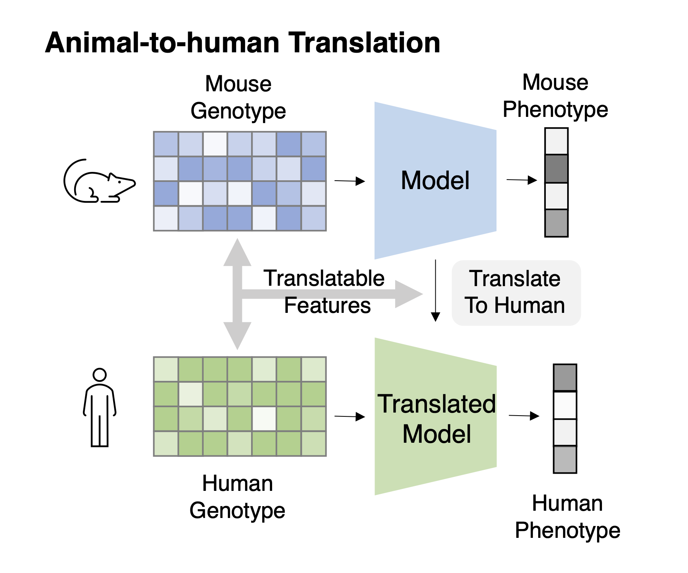

## Animal-to-human translation | 💻 + 🐁 = ❤️
In the context of **Machine Learning** applied to **Genomics data** for improving **clinical trials**.

The problematic we're dealing in this repo is based on the survey paper:
[Machine Learning Applications for Therapeutic Tasks with Genomics Data](https://www.cell.com/patterns/pdf/S2666-3899(21)00176-8.pdf).
*Kexin Huang, Cao Xiao, Lucas M. Glass, Cathy W. Critchlow, Greg Gibson, Jimeng Sun* Published in Patterns.

It focuses on the **ML for Genomics in Clinical Study** part of the above paper.

**Theme 1:** Translating pre-clinical animal models to humans

**Task 1:** Cross-species genotype-phenotype translation   

**Task Description:** Given genotype-phenotype data of animals and only the genotype data of humans, train the model to fit phenotype from the genotype and transfer this model to human.

The purpose of this job is to anticipate the **drug response** of a certain human genotype.

## Applying BERT...
- to **classifying DNA sequences as being associated to a specific drug response**
- 98-99% is **non-coding DNA**, yet we still don't know what is doing ? 
- **non-coding DNA** is very similar to human language
- **K-mer** tokens have a length of 3-6 base pairs
- **DNA sequence** with a maximum length of 512 base pairs
- Masking of **15% of DNA** sequence for unsupervised learning
- SNPs - 'SNIPS' single nucleotide polymorphism
- **Supervised learning** on the task of classifying DNA sequences as being associated to a specific **drug response**
  - Need for **labels** on the drug response
- **non-coding DNA** has regulatory function, yet not known
- SNPs can predispose to chronic diseases such as cancer, alzheimer, schyzophrenia, etc. 

## Training networks
A **DNABERT**: _pre-trained Bidirectional Encoder Representations from Transformers model for DNA-language in genome_ **network** for **kmer=6** took about **25 days** on **8 NVIDIA 2080Ti GPUs** to learn on human DNA.
[DNABERT6](https://drive.google.com/file/d/1BJjqb5Dl2lNMg2warsFQ0-Xvn1xxfFXC/view?usp=sharing)

What if we can learn models about the **non-coding DNA** function in other species and transfer this knowledge to a specific human genome?

## Useful links

- Database of genome wide association studies - https://www.ebi.ac.uk/gwas/
- Database of annotated enzymes by its function - http://www.uniprot.org/. 
- Database of enzyme reactions: https://www.expasy.org/.
- Paper on generating DNA sequences using GANs - https://arxiv.org/pdf/1712.06148.pdf
- Paper on generating peptides: https://arxiv.org/pdf/1804.01694.pdf

Papers influenced:
- An Empirical Evaluation of Generic Convolutional and Recurrent Networksfor Sequence Modeling: https://arxiv.org/pdf/1803.01271.pdf
- Large Scale GAN Training for High Fidelity Natural Image Synthesis: https://arxiv.org/pdf/1809.11096.pdf
- Progressive Growing of GANs for Improved Quality, Stability, and Variation: https://arxiv.org/pdf/1710.10196.pdf
- Spectral Normalization for Generative Adversarial Networks: https://arxiv.org/abs/1802.05957.pdf
- Improved Techniques for Training GANs: https://arxiv.org/pdf/1606.03498.pdf
- Spectral Normalization for Generative Adversarial Networks: https://arxiv.org/pdf/1802.05957.pdf
- Multi-Scale Context Aggregation by Dilated Convolutions: https://arxiv.org/pdf/1511.07122.pdf
- Self-Attention Generative Adversarial Networks: https://arxiv.org/pdf/1805.08318.pdf
- cGANs with Projection Discriminator: https://arxiv.org/pdf/1802.05637.pdf
- A Style-Based Generator Architecture for Generative Adversarial Networks: https://arxiv.org/pdf/1812.04948.pdf
- Which Training Methods for GANs do actually Converge? https://arxiv.org/pdf/1801.04406

## Citation
Yanrong Ji, Zhihan Zhou, Han Liu, Ramana V Davuluri, DNABERT: pre-trained Bidirectional Encoder Representations from Transformers model for DNA-language in genome, Bioinformatics, 2021;, btab083, https://doi.org/10.1093/bioinformatics/btab083
https://github.com/jerryji1993/DNABERT
